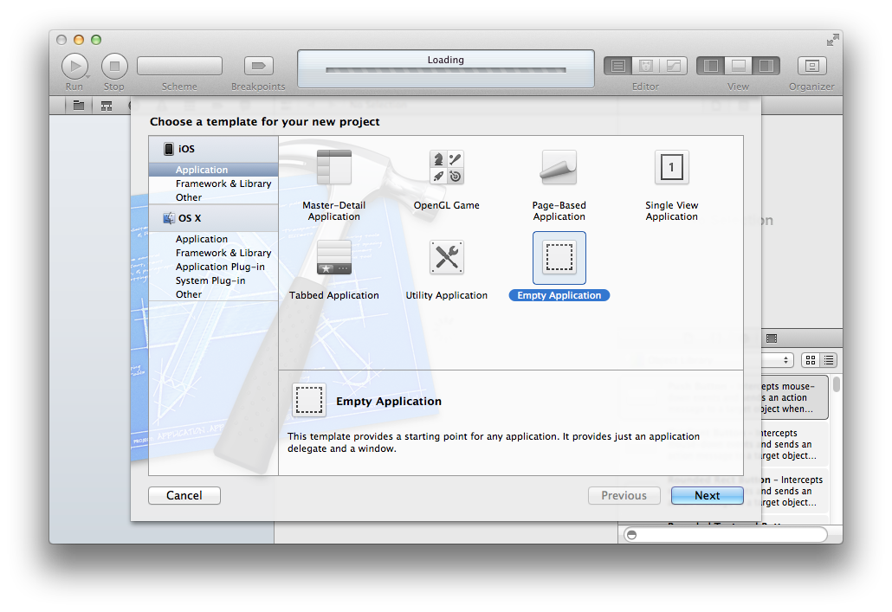
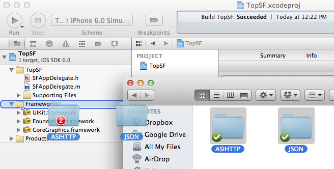
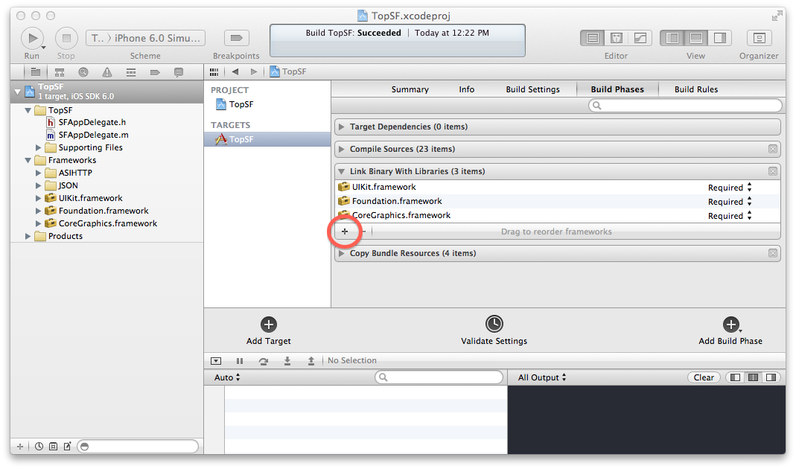

第一个iOS应用
==
iOS应用中最常用的一个视图是TableView，也是在iOS默认应用中出镜率最高的视图。第一个应用，我们就基于TableView只做一个包含列表页和详情页的SegmentFault Top 10应用。

在这个应用中，我们会涉及到：导入第三方组件，处理网络请求，Json解析，混编ARC和非ARC代码，扩展一个类，UITableView，WebView等，但这个Demo应用旨在介绍iOS应用的视图结构和创建工程的流程，让大家对iOS应用有一个初步的认识，不求对应用的每一个细节都熟练掌握。

在开发第一个Demo的过程中，一定会有很多地方存在疑问，你可以尝试自己研究或到 http://segmentfault.com 提问求助其他人。在随后的文章中，会介绍iOS开发的模式，编码习惯，编码技巧等，这些疑问会一一解开。

创建工程
---
打开Xcode（最新版 Xcode 4.5），使用快捷键 shift + cmd + n（或在菜单栏 file-new-project）创建一个新工程。

选择Empty Application，点击下一步

填写工程信息：

	Product Name						：应用在桌面上显示的名字
	Organization Name					：应用所属组织的名字，每一个代码文件的头上都会显示
	Company Identifier					：一个标示应用的前缀，相当于应用ID
	Class Prefix						：你工程里类名的默认前缀，Xcode自动生成代码会用到
	Use Automatic Reference Counting	：开启ARC功能

**Demo应用只填写这五项，点击下一步，储存工程。**

配置工程
---
导入此次开发所需的第三方组件，ASIHttpRequest（[http://allseeing-i.com/ASIHTTPRequest/](http://allseeing-i.com/ASIHTTPRequest/)）用于处理网络请求，和SBJson（[http://stig.github.com/json-framework/](http://stig.github.com/json-framework/)）用于解析Json。下载第三方的代码，直接拖动放进工程的Framework目录，点击Finish完成导入。

这两个第三方组件都依赖一些库，需要一一导入。选择Build Phases -> Link Binary Libraries

需要导入的库包括：

	CFNetwork.framework
	SystemConfiguration.framework
	MobileCoreServices.framework
	CoreGraphics.framework
	libz.dylib

ASIHttpRequest不支持ARC，给所有的ASIHttpRequest文件加-fno-objc-arc参数。

开始编码
---
创建静态类，兼容不支持ARC的ASIHttpRequest。使用快捷键 cmd + n（或在菜单栏 file-new-file）创建文件，选择Objective-C Class，点击下一步，填写类名和父类，下一步储存文件。

给这个文件也加上 -fno-objc-arc 参数。

SFHttpRequest这个类是一个比较复杂的类，涉及到许多iOS编码技巧和编码习惯。在第一个Demo中主要目的是熟悉iOS应用的结构，并写出一到两个界面。因此，对于这个类只求会用，在后续的文章中将逐步介绍其中的用法和原理。

做好了这些准备，开始进入界面和业务逻辑的编码。

在此之前，先介绍一下iOS视图的基础知识。在iOS应用中的视图都是UIView或UIView的子类。iOS应用中所有视图按照树状结构组织在一起，孩子节点是其父节点的子视图（subView）。这棵视图树只有一个根节点，根节点的类型是UIWindow，也是UIView的子类，在AppDelegate的方法中进行初始化。根节点的孩子节点一般是由UIViewController控制的视图，而用户自定义的视图（可以不需要UIViewController控制，而直接作为子视图）则更靠近叶子节点。

创建第一个ViewController，SFQuestionListViewController。同上的方法创建一个文件，继承自UIViewController，类名为SFQuestionListViewController。这个ViewController要控制UITableView一列表的形式展示数据，因此要实现UITableViewDataSource和UITableViewDelegate两个protocol。

【代码 SFQuestionListViewController.h】

【代码 SFQuestionListViewController.m】

一个完整的问题列表页代码完成，要展示这个列表页，还要把SFQuestionListViewController的view属性（UIView类型）作为subView加入根节点的UIWindow。这个逻辑在AppDelegate中实现。

【代码 SFAppDelegate.h】

【代码 SFAppDelegate.m】

程序运行流程，首先初始化SFAppDelegate对象，调用实例方法，初始化UIWindow对象，调用makeKeyAndVisible方法，显示该视图。初始化SFQuestionListViewController，并把其view属性加入UIWindow。SFQuestionListViewController调用loadView方法（UIViewController中的方法，在SFQuestionListViewController中没有重写），装载视图，完成后调用viewDidLoad方法。初始化UITableView，加入SFQuestionListViewController的view，触发UITableViewDataSource方法，渲染UITableView，没有数据，是个空的UITableView。继续调用refresh方法，发送异步数据请求。请求完成，回调成功方法getTopListSuccess:，格式化列表数据，UITableView重新载入数据，渲染视图。

问题列表页完成后，使用WebView实现一个问题详情页（直接调用 http://segmentfault.com 的网页显示问题详情）。同样方法，创建一个SFWebViewController。在SFWebViewController中要控制WebView的各种动作，因此实现UIWebViewDelegate这个protocol。在这个ViewController中底部的ToolBar要用到两个按钮图片，向工程中添加图片的方法同添加第三方代码，直接拖拽，放在合适的位置，点击finish。

【代码 SFWebViewController.h】

【代码 SFWebViewController.m】

SFWebViewController定义完成后，与SFQuestionListViewController连接起来，在SFQuestionListViewController的UITableViewDelegate实例方法中实现。通过调用presentViewController:animated:completion:方法唤起。

【代码 SFWebViewController.m 44-53行】

WebView的运行流程，当SFWebViewController初始化并被唤起，调用loadView方法，装载视图，完成后调用viewDidLoad方法，原理同上。在viewDidLoad方法中，初始化UIWebView，并设置一系列参数，决定这个WebView的功能和状态，加入SFWebViewController的view。初始化底部的ToolBar，设置各个按钮，并加入view。创建一个HTTP请求，加载到WebView上，这也是一个异步请求，开始加载后，回调webViewDidStartLoad:通知SFWebViewController。请求完成后回调webViewDidFinishLoad:，刷新ToolBar按钮状态。

至此，这个Demo应用SegmentFault Top 10就完成了。在开发过程中遇到的任何问题，都可以到 [http://segmentfault.com](http://segmentfault.com) 提问，求助大家。
